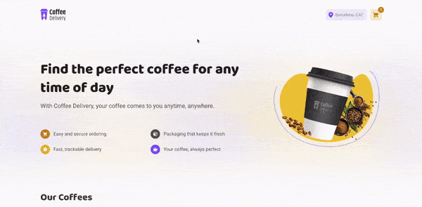

# ☕ Coffee Delivery - Your Perfect Coffee Experience

    

Welcome to **Coffee Delivery**, where every cup is crafted to perfection! Great coffee, effortless ordering, and fast delivery – because you deserve the best.

Explore a variety of premium coffees, from bold espressos to smooth lattes, all carefully selected to satisfy every taste. Customize your order, add your favorite blends to the cart, and enjoy a seamless checkout experience.

 

🔗 **Live Project:** [martonpaulo.github.io/coffee-delivery](https://martonpaulo.github.io/coffee-delivery)

 

Check out the Figma prototype here (Portuguese): [Figma Link](https://www.figma.com/design/6PVgXuZRHmlkpMQp6z0V7L/Coffee-Delivery?node-id=0-1&t=FlCpcOetQoX21a55-1).

This project is based on a RocketSeat tutorial.

For more of my work, visit my portfolio: [martonpaulo.com](https://martonpaulo.com).

## 🔧 Features

1. Browse a list of available coffee products
2. Add a specific quantity of items to the cart
3. Increase or remove item quantities in the cart
4. Fill out a form with shipping details
5. Display the total number of items in the cart in the header
6. Show the total cost based on item quantity and price

## 🛠️ Technologies Used

This project is built with: React, Vite, TypeScript, Styled Components and Context API.

## 🚀 Getting Started

To get started with the project, follow these steps:

1. Clone the repository: `git clone https://github.com/martonpaulo/coffee-delivery.git`
2. Navigate to the project directory: `cd coffee-delivery`
3. Install the dependencies: `npm install`

## 📜 Available Scripts

In the project directory, you can run the following scripts:

- **`npm run dev`** - Starts the development server at `http://localhost:3000/coffee-delivery`.
- **`npm run build`** - Builds the project for production, outputting the files to the `dist` folder.
- **`npm run lint`** - Runs ESLint to lint the code and ensure code quality.

## TODO List

- [x] Set up project with Vite, React, and TypeScript
- [x] Set up GitHub repository
- [x] Add GitHub description
- [x] Add README description
- [x] Add License
- [x] Set up ESLint
- [x] Add project favicon
- [x] Change port to 3000
- [x] Initial setup by clearing unnecessary files
- [x] Update `package.json` settings
- [x] Add GitHub Actions and deploy to GitHub Pages
- [x] Styled Components
- [x] Props
- [x] Componentization
- [x] Display a list of available coffee products
- [x] Lists and keys in React
- [ ] Include a limit of items for each product
- [ ] State management
- [ ] Context API
- [ ] LocalStorage
- [ ] State immutability
- [ ] Array manipulation with the `reduce` method
- [ ] Add a specific quantity of items to the cart
- [ ] Increase or remove item quantities in the cart
- [ ] Create a form for users to enter their address
- [ ] Show the total number of items in the cart in the header
- [ ] Display the total cost based on item quantity and price
- [ ] Add project recording
- [ ] Add project to portfolio

## 📄 License

This project is licensed under the **MIT License**. For more details, see the [LICENSE](LICENSE) file.
